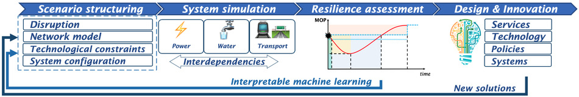

   
Introduction
==================

This package was developed as part of the Disaster REsilience Assessment, 
Modelling, and INno-vation Singapore (DREAMIN'SG) project at the Future 
Resilient Systems of the Singapore-ETH Centre. The DREAMIN'SG project is 
funded by the National Research Foundation, Singapore under the Intra-CREATE 
grant program. In the wake of increasing threats posed by climate change 
on urban infrastructure [#]_, this project aims at 
studying the effects of policy interventions and network characteristics on 
the resilience of urban infrastructure networks. Given the critical nature of 
the above infrastructure systems, their interdependencies need to be 
considered in pre- and post-disaster resilience actions. 

In specific, the DREAMIN'SG project envisaged to build a platform to assess and predict 
the resilience of urban infrastructure systems and propose new pathways to 
develop innovative technologies and services for its improvement. The urban 
infrastructure system is modeled as an interdependent power-, water-, and 
transportation network that interact with each other before, during and 
after a disaster. The researchers are developing an integrated simulation 
model to study the performance of the interdependent infrastructure network 
under various disruption and recov-ery scenarios. Based on the 
simulation-generated datasets, machine learning algorithms are implemented
to understand the causal relationship between topological and policy-related
interventions and disaster risks. The results of the research are intended to support local governments and system managers 
to improve infrastructure resilience against weather-related disruptions. 
The methodology adopted in the study is presented in Fig. 1.

   Figure 1. Methodological framework of DREAMIN'SG project

The steps of the project are summarized as follows:

   1. Multiple scenarios are generated by considering different disruptions, network models, technological constraints and system configurations.
   2. A simulation model is created for the interdependent power grid, water distribution system, and road transportation system.
   3. Resilience is assessed based on the simulated performance of the three systems.
   4. An interpretable machine learning algorithm is implemented to analyze the scenarios and extract information related to key system features that influence resilience.
   5. The identified system features inform the design of new services, technologies, and prod-ucts that are able to simultaneously enhance resilience and accommodate the technological constraints. 

For further information and updates on the project, please visit the 
`DREAMIN'SG webpage <https://frs.ethz.ch/research/projects/dreamin_sg.html>`_. 
In the rest of the documentation, the details of the interdependent infrastructure 
simulation platform,including its modeling, installation, and usage are 
discussed.

.. [#] Nissen, K. M. and U. Ulbrich (2017). Increasing frequencies and changing characteristics of heavy precipitation events threatening infrastructure in Europe under climate change. Natural Hazards and Earth System Sciences, 17(7), 1177–1190. ISSN 16849981.