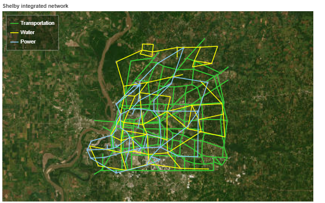

   
    
Getting started
===============

This chapter provides a step-by-step tutorial for running a model predictive control (MPC) method
to identify the optimal repair strategy after a disruptive event.
It is suggested to create a Jupyter notebook inside the notebooks folder as below:

.. code-block:: bash

    $ cd notebooks
    $ conda activate redcar
    (infrarisk) $ conda install ipykernel
    (infrarisk) $ ipython kernel install –user –name=infrarisk

The browser would open showing available notebook kernels. Select redcar from options to open
a Jupyter notebook that can run the integrated simulation model.

Shelby county simulation demonstration
--------------------------------------

Load required modules and libraries
^^^^^^^^^^^^^^^^^^^^^^^^^^^^^^^^^^^^

Now run the following IPython extensions to reload all modules within the simulation package and
set the Jupyter notebook.

.. code-block:: python

    %load_ext autoreload
    %autoreload 2

    from IPython.core.display import display, HTML
    display(HTML(""))
    from IPython.core.interactiveshell import InteractiveShell
    InteractiveShell.ast_node_interactivity = "all"

Now, load the required modules and external libraries manually as follows:

.. code-block:: python

    from pathlib import Path
    from infrarisk.src.network_recovery import *
    import infrarisk.src.simulation as simulation
    from infrarisk.src.physical.integrated_network import *
    import infrarisk.src.recovery_strategies as strategies
    import infrarisk.src.socioeconomic.se_analysis as se_analysis
    from infrarisk.src.physical.interdependencies import *

    import infrarisk.src.plots as model_plots
    import warnings
    warnings.filterwarnings('ignore')

Create an IntegratedNetwork object and load inidividual networks
^^^^^^^^^^^^^^^^^^^^^^^^^^^^^^^^^^^^^^^^^^^^^^^^^^^^^^^^^^^^^^^^^^^

In order to create the integrated infrastructure model, first we need to initiate the
IntegratedNetwork object from the integrated_network module. Then the individual models
should be loaded one by one to the ``IntegratedNetwork`` object. For this study, we use a simplified
integrated network consisting of a few nodes and links.

.. code-block:: python

    shelby_network = IntegratedNetwork(name = "Shelby")

    MAIN_DIR = Path('../..')
    SIM_STEP = 60

    network_dir= 'infrarisk/data/networks/shelby'
    water_folder = MAIN_DIR/f'{network_dir}/water'
    power_folder = MAIN_DIR/f'{network_dir}/power'
    transp_folder = MAIN_DIR/f'{network_dir}/transportation/reduced'

    # load all infrastructure networks
    shelby_network.load_networks(water_folder=water_folder, 
                                power_folder=power_folder, 
                                transp_folder=transp_folder,
                                sim_step=SIM_STEP)

Next, the individual infrastructure networks will be converted into a ``networkX`` object for plotting
purposes.

.. code-block:: python

    shelby_network.generate_integrated_graph(basemap = True)

The above method will create the object and outputs the integrated graph (:numref:`shelby_network`) consisting of the
topologies of all the three infrastructure networks that were loaded.

.. _shelby_network:

    Integrated network of Shelby County, TN

In the next step, we need to build the interdependencies within the integrated network. In this
model, three types of interdependencies are considered.

    #. Water pump on electric motor (water system on power system dependency)
    #. Power generator on reservoir (power system on water system dependency)
    #. All power and water system components on nearest transportation network node (power and
       water systems on transportation system dependency)

The information related to the first two types of dependencies must be provided in the form of csv
file whereas the third set of dependencies will be automatically identified by the simulation model.

.. code-block:: python

    dependency_file = MAIN_DIR/f"{network_dir}/dependencies.csv"
    shelby_network.generate_dependency_table(dependency_file = dependency_file)

The dependencies are referenced using two pandas dataframes in the model.

    - ``wp_table`` stores water - power dependencies.
    - ``access_table`` stores transportation access dependencies.

In order to view the wp_table, the following line of code may be implemented. It will return the
table shown in Table 7.

.. code-block:: python

    shelby_network.dependency_table.wp_table.head()

+----------+----------+------------+------------+
| water_id | power_id | water_type | power_type |
+==========+==========+============+============+
|   W_WP81 |   P_MP81 |       Pump |      Motor |
+----------+----------+------------+------------+
|   W_WP82 |   P_MP82 |       Pump |      Motor |
+----------+----------+------------+------------+
|   W_WP83 |   P_MP83 |       Pump |      Motor |
+----------+----------+------------+------------+
|   W_WP84 |   P_MP84 |       Pump |      Motor |
+----------+----------+------------+------------+
|   W_WP85 |   P_MP85 |       Pump |      Motor |
+----------+----------+------------+------------+

Similarly, the access_table can be printed which will return a table as shown in Table 8.

.. code-block:: python

    shelby_network.dependency_table.access_table.head()

+-----------+-----------+------------+-----------------------+-------------+
| origin_id | transp_id | origin_cat |           origin_type | access_dist |
+===========+===========+============+=======================+=============+
|   P_B40L0 |    T_J153 |      power | Bus connected to load |     2202.69 |
+-----------+-----------+------------+-----------------------+-------------+
|   P_B57L0 |    T_J153 |      power | Bus connected to load |     3411.97 |
+-----------+-----------+------------+-----------------------+-------------+
|    P_B2L0 |     T_J58 |      power | Bus connected to load |     1262.27 |
+-----------+-----------+------------+-----------------------+-------------+
|   P_B12L0 |    T_J183 |      power | Bus connected to load |     1195.67 |
+-----------+-----------+------------+-----------------------+-------------+
|   P_B49L0 |     T_J54 |      power | Bus connected to load |      698.73 |
+-----------+-----------+------------+-----------------------+-------------+

Load socioeconomic data for Shelby County
^^^^^^^^^^^^^^^^^^^^^^^^^^^^^^^^^^^^^^^^^^^^

Before we initiate the simulations, we need to download the socio-economic data for Shelby county. The following
code does that. Please note that socioeconomic analysis is only specific to Shlby county and may not work in the case of other 
available networks in this package. The user may use the socio-economic module for retrieving data for other counties in the United States.

.. code-block:: python

    year, tract, county, state = 2017, '*', 157, 47
    county = 157
    se_dir = MAIN_DIR/f"{network_dir}/gis/se_data"
    if not os.path.exists(se_dir):
        os.makedirs(se_dir)

    ShelbySE = se_analysis.SocioEconomicTable(name = 'Shelby', year = year, 
                                                tract = tract, state = state, 
                                                county = county, dir = se_dir)

    ShelbySE.download_se_data(force_download = False)
    ShelbySE.create_setable()

.. code-block:: python

    ShelbySE.plot_interactive(type = "annual receipts")

The above code would produce an interative map showing the annual industrial output from various 
zipcodes of Shelby County in Tennessee.

Generate disaster scenario and set infrastructure component disruptions
^^^^^^^^^^^^^^^^^^^^^^^^^^^^^^^^^^^^^^^^^^^^^^^^^^^^^^^^^^^^^^^^^^^^^^^^

The information regarding the dursuptive events are also stored in the IntegratedNetwork object.
The data related to disrupted components and the level of damage must be provided in csv file
format.

.. code-block:: python

    scenario_folder = f"scenarios/scenario1"
    disruption_file = MAIN_DIR/f"{network_dir}/{scenario_folder}/disruption_file.dat"

    shelby_network.set_disrupted_components(disruption_file=disruption_file)
    disrupted_components = shelby_network.get_disrupted_components()
    print(*disrupted_components, sep = ", ")

In this example, 14 components in the integrated network are failed, including six water pipes,
six power lines and two road links. The disruptive events table can be returned using the following 
code.

.. code-block:: python

    shelby_network.get_disruptive_events()

The returned pandas dataframe would like the one below (Table 6). It shows the time (``time_stamp``)
in seconds at which the component (``components``) failed and the intensity of damage in percentage
(``fail_perc``).

Set initial locations of restoration crews
^^^^^^^^^^^^^^^^^^^^^^^^^^^^^^^^^^^^^^^^^^^^^

To perform the restoration and recovery of damaged or failed components after disruptive event occurs,
each of the infrastructure agency has a repair crew. Once the disaster hits, each of these crews
are sent to the locations of the damaged infrastructure components based on a recovery strategy. To
set the initial locations of the water- power-, and transportation system repair crews, the following
method is initiated.

.. code-block:: python

    crew_count = 10
    shelby_network.deploy_crews(
        init_power_crew_locs=['T_J8']*crew_count, 
        init_water_crew_locs=['T_J8']*crew_count,
        init_transpo_crew_locs= ['T_J8']*crew_count
        )

In the current example, for simplicity and demonstration purpose, the initial locations of all the
three repair crews are set as ``T_J8``, which is a transportation node (junction).

Simulation of restoration and recovery process
^^^^^^^^^^^^^^^^^^^^^^^^^^^^^^^^^^^^^^^^^^^^^^^^^

The next step is to create a ``NetworkRecovery`` object. The ``NetworkRecovery`` object stores recovery
related information including the start times and end times of various repair actions.

.. code-block:: python

    network_recovery = NetworkRecovery(shelby_network, 
                                   sim_step=SIM_STEP, 
                                   pipe_close_policy="repair",
                                   pipe_closure_delay= 12*60, 
                                   line_close_policy="sensor_based_line_isolation",
                                   line_closure_delay= 12*60)

Now, a ``NetworkSimulation`` object is created which include methods to performactions to simulate direct and
indirect impacts in the network due to the external event as well as recovery actions.

.. code-block:: python

    bf_simulation = simulation.NetworkSimulation(network_recovery)

Now, we define repair strategy and generate the repair sequence. Here, we adopt ``HandlingCapacityStrategy`` in which the repair sequence is generated based of the maximum daily 
infrastructure service flow handled by the component under normal operating conditions.

.. code-block:: python

    capacity_strategy = strategies.HandlingCapacityStrategy(shelby_network)
    capacity_strategy.set_repair_order()
    repair_order = capacity_strategy.get_repair_order()

    import os
    if not os.path.exists(MAIN_DIR/f"{network_dir}/{scenario_folder}/capacity"):
        os.makedirs(MAIN_DIR/f"{network_dir}/{scenario_folder}/capacity")

The next step is to schedule the recovery actions based on the repair sequence as follows:

.. code-block:: python

    bf_simulation.network_recovery.schedule_recovery(repair_order)
    bf_simulation.expand_event_table()          

Finally, we run the integrated infrastructure simulation model to simulate the indirect effects of the initial 
infrastructure disruptions. The results of the simulation (including the node-level water and power demands) are stored in the ``ResilienceMetrics`` object.

.. code-block:: python

    resilience_metrics = bf_simulation.simulate_interdependent_effects(
                                            bf_simulation.network_recovery)

Once the simulation is completed, the results can be saved in a ``csv`` file using the following code.

.. code-block:: python

    strategy = 'capacity'
    bf_simulation.write_results(f"{MAIN_DIR}/{network_dir}/{scenario_folder}/{strategy}", 
                                resilience_metrics)

Quanitification of loss using resilience metrics
^^^^^^^^^^^^^^^^^^^^^^^^^^^^^^^^^^^^^^^^^^^^^^^^^^^

The ``ResilienceMetrics`` object stores the results of the simulation. The following code calculates the water and power
resilience values. The average network resilience is also calculated which is the weighted sum of the water and resilience 
values.

.. code-block:: python

    resilience_metrics.calculate_power_resmetric(network_recovery)
    resilience_metrics.calculate_water_resmetrics(network_recovery)

    resilience_metrics.set_weighted_auc_metrics()

In addition to the functional resilience values, we can also calculate the economic costs of business disruptions if the industry
data is available for the network under study. The following code calculates the sector-wise economic costs of business disruptions.

.. code-block:: python

    ShelbySE.combine_infrastructure_se_data(shelby_network, resilience_metrics)
    ShelbySE.calculate_economic_costs()
    ShelbySE.economic_cost_df.to_csv(f"{MAIN_DIR}/{network_dir}/{scenario_folder}/{strategy}/economic_cost.csv", index=False)

Plot simulation results
^^^^^^^^^^^^^^^^^^^^^^^^^

The network performance of water and power systems during the simulation can be visualized using the following code.

.. code-block:: python

    model_plots.plot_interdependent_effects(resilience_metrics, metric = 'pcs', title = False)

The following code plots the map of the network showing the initial diruptions and the initial locations of the repair crews.

.. code-block:: python

    model_plots.plot_disruptions_and_crews(shelby_network, basemap = True)

At the same time, the following code can be used to plot the equivalent outage hours (resilience metric to quantify operational loss)
of the water and power systems in various buildings or service areas.

.. code-block:: python

    split_water_sa = gpd.overlay(shelby_network.wn.service_area, ShelbySE.county_gpd_truncated, how='intersection')
    split_power_sa = gpd.overlay(shelby_network.pn.service_area, ShelbySE.county_gpd_truncated, how='intersection')
    sa_dict = {'Water': split_water_sa, 'Power': split_power_sa}

    model_plots.plot_region_impact_map(resilience_metrics, sa_dict, "capacity", extends = ShelbySE.bounds)

The following code produces an interactive map that shows the sector-wise economic loss of business disruptions due the simulated event.

.. code-block:: python

    ShelbySE.plot_interactive(type = "economic costs")

Additional tutorials
--------------------

There are several Jupyter notebooks in ``infrarisk/notebooks`` that demonstrate the use of various features of the package,
including generating hazards and interdependent infrastructure simulations based on other networks.